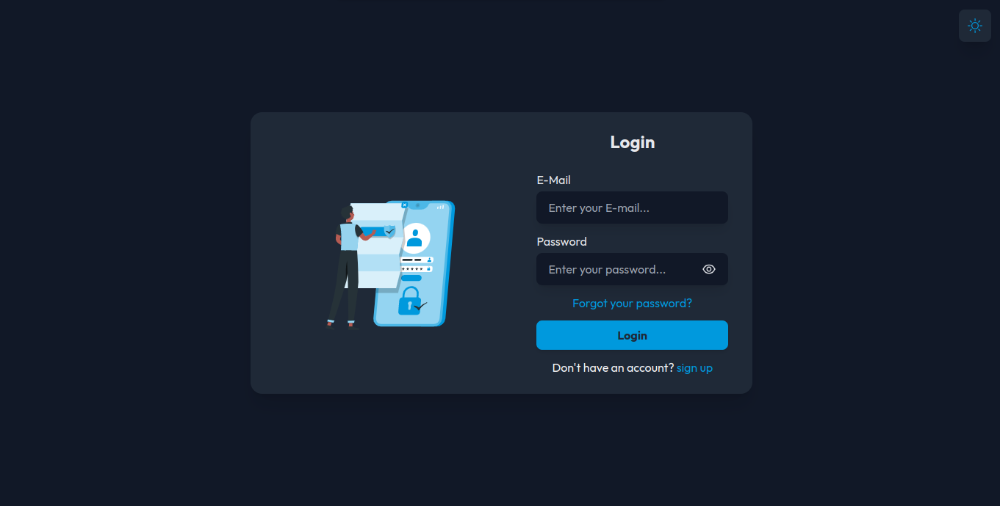

# GAuth

This is a frontend project for a login application developed in React and Node.js that aims at user security.

## Functionalities

The user login and registration application has the following features:

- Login with email and password;
- Validation of empty fields and correct email formatting;
- Password recovery by sending e-mail;
- Choice of theme for interface customization;
- User registration with name, email, password and password confirmation.

When using the application, the user can log in or register as a new user, providing the necessary information to create an account. It is also possible to recover the password by sending an email. In addition, the user can choose a theme to customize the appearance of the interface.

## Technologies used

- React
- Axios
- Yup
- React Icons
- React Router
- TailwindCSS
- <a href="https://storyset.com/user">User illustrations by Storyset</a>

## How to use

To use the application, just access the link https://gauth-nine.vercel.app/

## How to install locally

1. Download the project to your computer or clone the repository using the following command:

```Shell
git clone https://github.com/Guilherme-Silva0/gauth-frontend.git
```

2. Open the terminal in the project directory and run the following command to install the dependencies:

```Shell
npm install
```

3. Then run the following command to launch the application:

```Shell
npm run dev
```

4. The application will open in your browser at the address [http://localhost:5173](http://localhost:5173).

## Screeshots

- Login:
  

- Login Dark Mode:
  

- Sign Up:
  

- Sign Up Dark Mode:
  

## License

This project is licensed under the MIT. For more information, see the LICENSE file.

## Final considerations

Hope you enjoyed this project! If you have any questions or suggestions, please feel free to get in touch.
